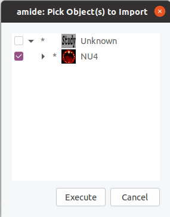
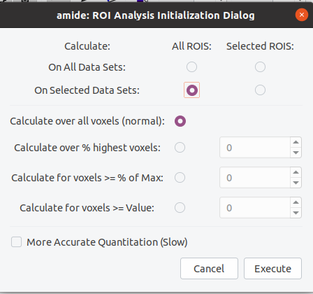

# Goal
This project provides a semi-automatic script to analyze the NEMA NU4 Image Quality phantom.
It relies on the Amide program to define where the volumes of interest (VOI) are relative to the PET image(s) to analyze.

# Summary of the NEMA NU4 IQ protocol:
There are three parts to the NENA NU4 IQ phantom:
- Uniformity: VOI with a diameter of 22.5 mm and a length of 10 mm
	- Report: Mean, Max, Min and %STD (Standard deviation divided by the means)
- Spillover ratios: Two VOIs with a diameter of 4 mm and a length of 7.5 mm (air and water)
	- Report: ratio of the mean activity of the VOIs and the mean activity in the uniform VOI.
- Recovery coefficients: Five VOIs with a diameter twice the rod diameter and length of 10 mm.
	- Averaging the voxels along the axial axis and determining the maximum average activity inside each VOI.
	- Report: 
		- Mean: ratio of the maximum average and the mean activity in the hot uniform VOI
		- Stdev: standard deviation of the activity along the axial axis at the position of the maximum average 
			activity.

# How to use this project

## Typical workflow 
- Use the provided Amide template to extract the VOIs
- Run the python script to compute the metrics required by the NEMA NU4 IQ analysis 

## Extracting the VOIs with Amide

- Open the PET image(s) of interest in `Amide`
 
- Load the Amide template provided in this project
	- `File` > `Import from XIF directory`
	- `Open` the Amide template, which should be named `NU4AnalysisTemplate.xif` 
	- In the `Pick Object(s) to Import` window, select `NU4` and click on `Execute`
	 
 
- Place the VOIs at the correct positions on the PET image(s)
	- See next sections for tips&tricks
 
- Extract the VOIs
	- In the `datasets` left column, tick the PET image(s) of interest
	- `Tools` > `Calculate ROI statistics`
		- In the `Calculate` upper part, tick the `All ROIs` and `On Selected Data Sets`
		- Click on `Execute`
		 
	- In the `amide Roi Analysis` window, select `Save Raw Values`
		- Choose a folder and name for the resulting `.tsv` file (e.g., `[path/filename].tsv`)
 
## Extract the metrics required for the NENA NU4 IQ report 
- In a terminal, execute the python script on the previously created `.tsv` file.
	- `python analysisNU4IQ.py -i [path/filename.tsv]`

## Quality of life options
- If a filename is provided with the `-o` flag, the results will be saved in the `csv` format.
- The flag `-n` can be used to provide IDs to the image(s) analyzed.   

# Placement of the VOIs using the template 

The Amide template provided aims to facilitate the placement of the VOIs.
In order to do so, we made a CT image of an empty NUMA NU4 phantom and placed the VOIs in the CT image.
Thus, you can, by moving the CT image (`NU4`), move all the VOIs at the same time. 
However, the NEMA NU4 phantom is composed of three axial segments and they are not physically bound to a specific orientation.
This means that it is highly likely that the VOIs provided does not correspond exactly to your acquisition. 
However, their order in the axial direction is always the same: first water and air; uniform; rods.
Thus, it is recommended to move the CT image first to fit the axial orientation and then move the VOIs to fit your PET image(s).

Tips:
- Always move the CT image and/or the VOIs toward your PET image and then save the resulting placement in a `.xif` file. Thus, if you want to analyze the same acquisition with a different reconstruction parameter, you only need to load the `.xif` directory to skip the placement of the VOIs
- Moving an image in Amide:
	- Mark it as active, e.g., `scrolling click`
	- `shift+left mouse`: Propose a translation (`Right click` to confirm)
	- `shift+right mouse`: Propose a rotation (`Right click` to confirm)

